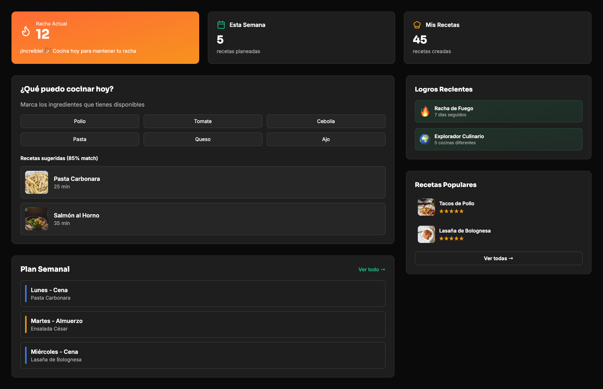
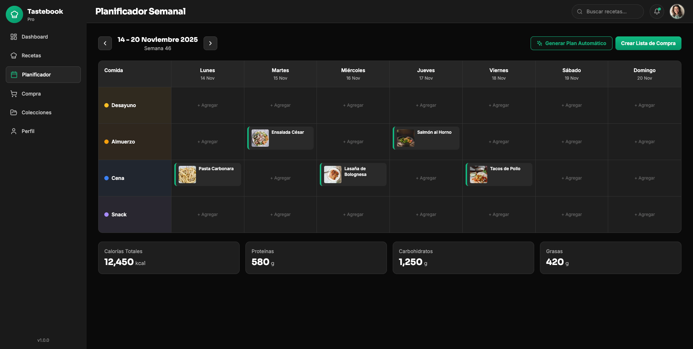
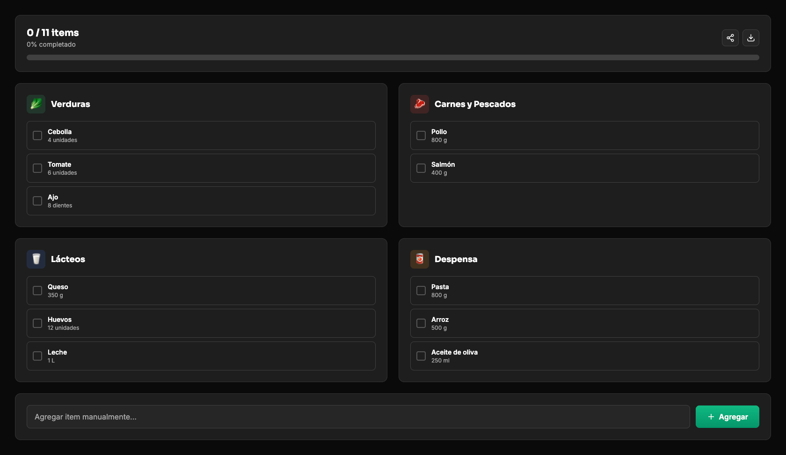

# Tastebook Pro

Plataforma web moderna de gestión de recetas con sistema de favoritos, planificación inteligente y modo cocina. Stack: React Router 7+ • TypeScript • Supabase • Tailwind CSS.

---

## 📸 Screenshots

### Menu Principal


### Planificador semanal


### Lista de la compra


---

## ✨ Features Principales

### ✅ Completadas (v0.4.1)

**🔐 Autenticación:**
- Sistema completo de auth con Supabase (login/register/logout)
- Perfiles de usuario con edición inline
- Upload de avatar con validación
- Session persistence

**📖 Gestión de Recetas:**
- CRUD completo con editor visual
- Subida de imágenes a Supabase Storage
- Búsqueda y filtros en tiempo real
- Recetas públicas y privadas
- Sistema de tags y categorización
- Cálculo de tiempos y porciones

**❤️ Sistema de Favoritos:**
- Página dedicada con hero gradient premium
- Búsqueda instantánea por título
- Filtros por dificultad (Fácil/Media/Difícil)
- Quick stats cards con métricas
- Botón de favorito en listados y detalles
- Optimistic updates con React Query
- Loading states y error handling
- Animaciones con Framer Motion
- Empty states con CTAs

**👤 Perfil de Usuario:**
- Dashboard con estadísticas
- Sistema de logros y achievements
- Activity timeline
- Stats cards animadas
- Tabs navigation (Resumen/Recetas/Logros)

**🎨 UI/UX:**
- Dark mode completo
- Diseño responsive mobile-first
- Animaciones suaves con Framer Motion
- Sistema de diseño consistente (Sora + Inter)
- Toast notifications con Sonner
- Loading skeletons
- Error boundaries

### ⏳ En Desarrollo

- Planificador semanal con drag & drop
- Lista de compra inteligente con agrupación
- Colecciones personalizadas

### 🔮 Roadmap Futuro

- Modo cocina fullscreen con timers
- Búsqueda avanzada con IA
- Importación desde URLs externas
- Sistema de reviews y ratings
- PWA con modo offline
- App móvil (React Native)

---

## 🛠️ Stack Tecnológico

**Backend & Database:**
- **Supabase** - PostgreSQL + Auth + Storage + Realtime
- **Row Level Security (RLS)** - Seguridad a nivel de fila
- **PostgreSQL Functions** - Lógica del lado del servidor

**Frontend:**
- **React 19** - Biblioteca UI
- **React Router 7.9+** - Routing con App Router
- **TypeScript 5.9+** - Tipado estático
- **Vite 6.4+** - Build tool y dev server
- **Tailwind CSS 3.4+** - Utility-first CSS

**State Management & Data Fetching:**
- **@tanstack/react-query 5.90+** - Server state management
- **Zustand** (futuro) - Client state (si es necesario)

**UI & Animaciones:**
- **Framer Motion 12.23+** - Animaciones declarativas
- **Lucide React 0.358+** - Iconografía moderna
- **Sonner** - Toast notifications
- **shadcn/ui** - Componentes base (parcial)

**Forms & Validation:**
- **React Hook Form 7.66+** - Gestión de formularios
- **Zod 4.1+** - Validación de esquemas

**Utilidades:**
- **date-fns 4.1+** - Manejo de fechas
- **clsx** - Class merging condicional
- **@dnd-kit/core 6.3+** - Drag & drop (futuro)

---

## 🚀 Quick Start

### Prerequisitos

- Node.js 18+ y pnpm
- Cuenta en Supabase (gratis)
- Git

### 1. Clonar el repositorio

```bash
git clone https://github.com/amolrod/tastebook-pro.git
cd tastebook-pro
```

### 2. Instalar dependencias

```bash
pnpm install
```

### 3. Configurar Supabase

**Opción A: Guía rápida**

1. Crea un proyecto en [supabase.com](https://supabase.com)
2. Obtén tus credenciales en **Settings → API**
3. Crea `apps/web/.env.local`:

```env
VITE_SUPABASE_URL=https://tu-proyecto.supabase.co
VITE_SUPABASE_ANON_KEY=tu-anon-key-aqui
```

4. Ejecuta el SQL de creación:
   - Ve a **SQL Editor** en Supabase
   - Copia y ejecuta el contenido de `/supabase_setup.sql`
   - Verifica en **Table Editor** que las tablas se crearon

5. Crea el bucket de Storage:
   - Ve a **Storage**
   - Crea bucket `recipe-images` (público)

**Opción B: Guía detallada**

📚 Sigue la guía completa: [docs/SUPABASE_GUIDE.md](docs/SUPABASE_GUIDE.md)

### 4. Iniciar servidor de desarrollo

```bash
cd apps/web
pnpm dev
```

La aplicación estará disponible en **http://localhost:4000** 🚀

---

## 📜 Scripts Disponibles

```bash
# Desarrollo
pnpm dev              # Iniciar servidor de desarrollo
pnpm typecheck        # Verificar tipos TypeScript

# Build (próximamente)
# pnpm build          # Build para producción
# pnpm lint           # Ejecutar linter
# pnpm test           # Ejecutar tests
```

---

## 📁 Estructura del Proyecto

```
tastebook-pro/
├── apps/
│   ├── web/                           # Aplicación web principal
│   │   ├── src/
│   │   │   ├── app/                  # Rutas y páginas (React Router)
│   │   │   │   ├── _layout.tsx      # Layout principal
│   │   │   │   ├── index.tsx        # Dashboard
│   │   │   │   ├── recipes/         # CRUD de recetas
│   │   │   │   ├── favorites/       # Sistema de favoritos
│   │   │   │   ├── profile/         # Perfil de usuario
│   │   │   │   └── auth/            # Login/Register
│   │   │   ├── components/          # Componentes React
│   │   │   │   ├── ui/              # Componentes base
│   │   │   │   ├── recipes/         # Componentes de recetas
│   │   │   │   └── layout/          # Header, Sidebar
│   │   │   ├── lib/                 # Utilidades y configuración
│   │   │   │   ├── supabase.ts     # Cliente Supabase
│   │   │   │   └── api/            # Servicios API
│   │   │   ├── hooks/               # Custom hooks
│   │   │   │   ├── useRecipes.ts   # Hook de recetas
│   │   │   │   ├── useFavorites.ts # Hook de favoritos
│   │   │   │   └── useAuth.ts      # Hook de auth
│   │   │   ├── contexts/            # Context providers
│   │   │   ├── types/               # Tipos TypeScript
│   │   │   └── utils/               # Funciones helper
│   │   ├── public/                  # Assets estáticos
│   │   ├── .env.local               # Variables de entorno (no en git)
│   │   └── package.json
│   └── mobile/                       # App móvil (futuro)
├── docs/                             # Documentación técnica
│   ├── SETUP.md                     # Guía de configuración
│   ├── SUPABASE_GUIDE.md           # Guía completa Supabase
│   ├── ARCHITECTURE.md              # Arquitectura del proyecto
│   ├── DATABASE.md                  # Schema y migraciones
│   ├── API.md                       # Documentación servicios/hooks
│   ├── COMPONENTS.md                # Catálogo de componentes
│   ├── CODE_CONVENTIONS.md          # Estándares de código
│   ├── STYLES.md                    # Sistema de diseño
│   └── ROADMAP.md                   # Sprints y próximos pasos
├── scripts/                          # Scripts de setup
├── README.md                         # Este archivo
├── CHANGELOG.md                      # Historial de cambios
└── supabase_setup.sql               # SQL de creación inicial
```

---

## 📖 Documentación

### Guías de Configuración

- **[SETUP.md](./docs/SETUP.md)** - Configuración paso a paso del entorno
- **[SUPABASE_GUIDE.md](./docs/SUPABASE_GUIDE.md)** - Guía maestra de Supabase (Auth, RLS, Storage)

### Documentación Técnica

- **[ARCHITECTURE.md](./docs/ARCHITECTURE.md)** - Arquitectura y patrones del proyecto
- **[DATABASE.md](./docs/DATABASE.md)** - Schema completo, migraciones y queries
- **[API.md](./docs/API.md)** - Documentación de servicios y hooks

### Desarrollo

- **[COMPONENTS.md](./docs/COMPONENTS.md)** - Catálogo completo de componentes UI
- **[CODE_CONVENTIONS.md](./docs/CODE_CONVENTIONS.md)** - Convenciones de código y mejores prácticas
- **[STYLES.md](./docs/STYLES.md)** - Sistema de diseño (colores, tipografías, espaciados)
- **[ROADMAP.md](./docs/ROADMAP.md)** - Sprints completados y próximos pasos

### Changelog

- **[CHANGELOG.md](./CHANGELOG.md)** - Historial detallado de cambios por sprint

---

## 🔗 Enlaces

- **Repositorio:** https://github.com/amolrod/tastebook-pro
- **Supabase:** [Tu dashboard de Supabase]
- **Deployment:** [URL cuando esté deployado]

---

## 📝 Workflow de Desarrollo

### Conventional Commits

Usamos el estándar de Conventional Commits:

```bash
feat(recipes): add drag and drop to planner
fix(auth): resolve session persistence issue
refactor(ui): improve button component API
docs: update SETUP guide with new instructions
style: format code with prettier
test: add unit tests for useRecipes hook
chore: update dependencies
```

### Branching Strategy

- `main` - Branch principal, código estable
- `feature/*` - Features nuevas (ej: `feature/meal-planner`)
- `fix/*` - Correcciones de bugs
- `docs/*` - Cambios en documentación

### Pull Requests

1. Crea un branch desde `main`
2. Implementa tu feature/fix
3. Asegúrate de que el código compila (`pnpm typecheck`)
4. Escribe commits descriptivos
5. Abre un PR con descripción clara

---

## 🤝 Contribución

Este es un proyecto personal en desarrollo activo. Pull requests y sugerencias son bienvenidas.

### Cómo contribuir

1. Fork el repositorio
2. Crea tu feature branch (`git checkout -b feature/AmazingFeature`)
3. Commit tus cambios (`git commit -m 'feat: add AmazingFeature'`)
4. Push al branch (`git push origin feature/AmazingFeature`)
5. Abre un Pull Request

---

## 📄 Licencia

MIT License - ver [LICENSE](LICENSE) para más detalles

---

## 📌 Mantenimiento de Documentación

### Para Desarrolladores

Al agregar nuevas features o hacer cambios significativos:

1. **Actualiza el código relevante**
2. **Documenta en el archivo apropiado:**
   - Nuevos componentes → `docs/COMPONENTS.md`
   - Cambios en DB → `docs/DATABASE.md`
   - Nuevos servicios/hooks → `docs/API.md`
   - Cambios de arquitectura → `docs/ARCHITECTURE.md`
3. **Añade entrada en `CHANGELOG.md`**
4. **Actualiza `README.md` si es feature mayor**
5. **Commit con mensaje descriptivo:** `docs: update COMPONENTS with new RecipeCard props`

### Reglas de Oro

- ✅ Mantén la documentación sincronizada con el código
- ✅ Usa ejemplos de código cuando sea posible
- ✅ Explica el "por qué", no solo el "qué"
- ✅ Actualiza los diagramas si cambia la arquitectura
- ✅ Elimina documentación obsoleta inmediatamente

---

**Última actualización:** 17 de noviembre de 2025  
**Versión:** v0.4.1 (Sprint 4 - Sistema de Favoritos UI)  
**Autor:** [@amolrod](https://github.com/amolrod)
test: añadir tests
chore: tareas mantenimiento
```

### Branches
- `main` - Branch principal estable
- `feature/*` - Features grandes

## 🤝 Contribución

Este es un proyecto personal en desarrollo activo. Pull requests y sugerencias son bienvenidas.

## 📄 Licencia

MIT License - ver LICENSE para más detalles

---

**Última actualización:** 17 de noviembre de 2025  
**Versión:** 0.4.1 (Sprint 4.1 - Sistema de Favoritos UI)
